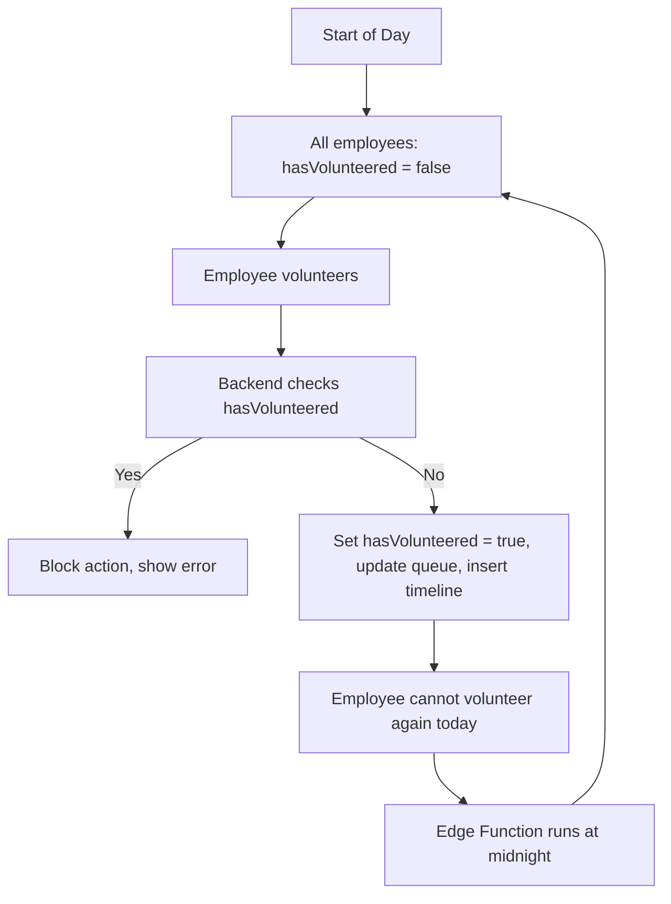

# 🚩 Things To Fix & Safety Concerns

- **File Naming Consistency:**  
  - Rename files like `googleSignInButton.tsx.tsx` to `GoogleSignInButton.tsx`.
  - Use PascalCase for React components and camelCase for hooks/utilities.

- **Error Handling:**  
  - Add user-friendly error messages and visual feedback (toasts/modals) for all user actions, especially failed volunteer attempts.
  - Ensure all API endpoints return consistent error structures.

- **Type Safety:**  
  - Ensure all hooks, helpers, and API routes use strict TypeScript types from `types/employee.ts` and `types/supabase.ts`.
  - Avoid using `any` or implicit `any` types.

- **Environment Variables:**  
  - Validate all required environment variables at startup and fail gracefully if missing.
  - Never expose sensitive keys (e.g., Supabase service role) to the client.

- **Security & RLS:**  
  - Review Supabase Row Level Security (RLS) policies to ensure users can only access their own data.
  - Protect all API endpoints from unauthorized access.

- **Accessibility:**  
  - Add ARIA labels, keyboard navigation, and ensure color contrast for all UI components.

- **Performance:**  
  - Paginate or virtualize large lists (e.g., employee stack, timeline) to avoid slow rendering.
  - Debounce or throttle real-time updates if needed.

- **Testing:**  
  - Add unit and integration tests for hooks, helpers, and API routes.

- **Edge Function Reliability:**  
  - Monitor the nightly Edge Function for failures (missed resets can block volunteering).

- **Data Consistency:**  
  - If using `totalVolunteeredHours` as a field, ensure it is always kept in sync with the timeline (prefer DB triggers).

---

# VolunteerV1 – In-Depth Technical Documentation

## Overview

**VolunteerV1** is a Next.js + Supabase application for managing employee volunteer shifts.  
Features include:

- Real-time queue management
- Volunteer timeline
- Authentication (Google OAuth & email)
- Ensures employees can only volunteer once per day
- Data integrity via Supabase triggers, Edge Functions, and frontend logic

---

## Project Structure

<details>
<summary><strong>Key Files & Folders</strong></summary>

- `app/layout.tsx`: Main layout, theme provider, Google OAuth, navigation, and footer.
- `components/employeeStack/employeeStack.tsx`: UI for the employee queue/stack.
- `components/employeeTimeline/employeeTimeline.tsx`: UI for the volunteer timeline.
- `lib/dbHelpers.ts`: Core backend logic for employee actions, timeline inserts, and helpers.
- `hooks/useQueue.ts`, `hooks/useTimeline.ts`: Data fetching and real-time subscriptions.
- `components/theme-switcher.tsx`: Theme toggle logic.
- `utils/supabase/`: Supabase client/server setup.
- `types/employee.ts`, `types/supabase.ts`: TypeScript types for strong typing.
- **Supabase Edge Function**: Custom serverless function for scheduled tasks (cron).
- **Supabase Database**: Tables for employees, timeline, and triggers/functions.

</details>

---

## Data Model

### `employees` Table

| Field                  | Type      | Description                                 |
|------------------------|-----------|---------------------------------------------|
| `id`                   | UUID      | Primary key                                 |
| `name`                 | Text      | Employee name                               |
| `profile_pic`          | Text      | Profile picture URL                         |
| `job_title`            | Text      | Employee job title                          |
| `position`             | Integer   | Queue position                              |
| `hasVolunteered`       | Boolean   | Can volunteer today? (reset nightly)        |
| `totalVolunteeredHours`| Integer   | (Optional) Sum of all volunteer hours       |
| ...other fields...     |           |                                             |

### `timeline` Table

| Field             | Type      | Description                                 |
|-------------------|-----------|---------------------------------------------|
| `id`              | UUID      | Primary key                                 |
| `employee_id`     | UUID      | Foreign key to employees                    |
| `action_type`     | Enum      | e.g., `"volunteer"`                         |
| `created_at`      | Timestamp | When the action occurred                    |
| `volunteer_minutes`| Integer  | Duration of the shift (minutes)             |
| `shift_hours`     | Integer   | Duration of the shift (hours)               |
| `notes`           | Text      | Free text                                   |

---

## Core Flow: Volunteering

### 1. Volunteering Action

**User clicks "Volunteer" in the EmployeeStack UI.**

**Frontend:**
```typescript
// ...existing code...
const res = await fetch('/api/employee/route', {
  method: 'POST',
  body: JSON.stringify({ userId, sessionMinutes }),
});
// ...existing code...
```

**Backend (`lib/dbHelpers.ts`):**
```typescript
// ...existing code...
export async function volunteerEmployee(userId: string, sessionMinutes: number) {
  // 1. Check if already volunteered today
  const employee = await getEmployee(userId);
  if (employee.hasVolunteered) throw new Error("Already volunteered today");

  // 2. Move to back of queue
  await moveToBackOfQueue(userId);

  // 3. Set hasVolunteered = true
  await setHasVolunteered(userId, true);

  // 4. Insert timeline entry
  await insertTimelineEntry(userId, sessionMinutes);

  // 5. (Optional) Update totalVolunteeredHours
  // ...existing code...
}
// ...existing code...
```

### 2. Preventing Double Volunteering

- The `hasVolunteered` flag is checked before allowing a volunteer action.
- If `hasVolunteered` is `true`, the backend blocks the action and returns an error.

---

## Nightly Reset: Supabase Edge Function & Cron

**How it works:**

- **Edge Function:** Runs nightly at 12am via Supabase cron.
- **Logic:** Resets `hasVolunteered` for all employees.

**Example SQL:**
```sql
update employees set hasVolunteered = false;
```

**Side Effect:**  
All employees become eligible to volunteer again at the start of each day.

---

## Data Consistency & Side Effects

- **Single Source of Truth:**  
  - `hasVolunteered` flag for daily check
  - `timeline` table for historical record

- **Edge Function Reset:**  
  - Guarantees daily limit is enforced and resets reliably

- **(Optional) `totalVolunteeredHours`:**  
  - Use a DB trigger to keep in sync with timeline, or always calculate from timeline for accuracy

**Potential Side Effects:**

- Manual timeline edits require updating `totalVolunteeredHours` (if used)
- Missed cron/Edge Function may block volunteering the next day
- Race conditions are prevented by backend checks and RLS

---

## Real-Time Updates

- **Supabase Realtime:**  
  Hooks (`useQueue`, `useTimeline`) subscribe to changes in `employees` and `timeline` tables.

**Example (React Hook):**
```typescript
// hooks/useQueue.ts
import { useEffect } from 'react';
import { supabase } from '../utils/supabase/client';

export function useQueue() {
  useEffect(() => {
    const subscription = supabase
      .channel('public:employees')
      .on('postgres_changes', { event: '*', schema: 'public', table: 'employees' }, payload => {
        // Update UI
      })
      .subscribe();

    return () => { supabase.removeChannel(subscription); };
  }, []);
}
```

---

## Theming & UI

- **ThemeSwitcher:**  
  Uses `next-themes` and is a client component.

**Example:**
```tsx
// components/theme-switcher.tsx
"use client";
import { useTheme } from "next-themes";

export function ThemeSwitcher() {
  const { theme, setTheme } = useTheme();
  // ...existing code...
}
```

- **UI Components:**  
  Built with Tailwind CSS and Framer Motion for smooth animations.

---

## Error Handling & User Feedback

- **Backend:**  
  Throws clear errors if an employee tries to volunteer twice in a day.

- **Frontend:**  
  Displays user-friendly error messages and loading states.

**Example:**
```tsx
// ...existing code...
try {
  await volunteerEmployee(userId, sessionMinutes);
} catch (e) {
  setError(e.message);
}
// ...existing code...
```

---

## Suggestions for Further Improvement

- Add DB triggers to keep `totalVolunteeredHours` in sync if you keep that field.
- Add admin UI for correcting mistakes (e.g., undoing a volunteer action).
- Monitor Edge Function health to ensure nightly resets always run.
- Expand tests for API routes, hooks, and helpers.
- Improve accessibility and add ARIA labels where needed.
- Paginate or virtualize large lists for performance.

---

## Diagram: Daily Volunteer Flow



---

## Summary Table

| Component/Process         | Role                                         | Side Effects/Notes                       |
|--------------------------|----------------------------------------------|------------------------------------------|
| EmployeeStack            | Shows queue, triggers volunteer action       | UI updates in real-time                  |
| EmployeeTimeline         | Shows volunteer history                      | UI updates in real-time                  |
| volunteerEmployee        | Handles backend logic for volunteering       | Throws if already volunteered            |
| hasVolunteered           | Prevents double volunteering per day         | Reset by Edge Function nightly           |
| Edge Function + Cron     | Resets all employees' hasVolunteered at 12am| All can volunteer again                  |
| totalVolunteeredHours    | (Optional) Fast reads, must be kept in sync  | Use trigger or always calculate on demand|

---

## Final Notes

- The architecture is robust: daily reset, backend checks, and real-time updates ensure fairness and data integrity.
- The only critical dependency is the nightly Edge Function—monitor it for reliability.
- For ultimate data integrity, prefer calculating totals from the timeline or use a DB trigger if you keep a summary field.

---

_Keep this documentation updated as your project evolves!_
